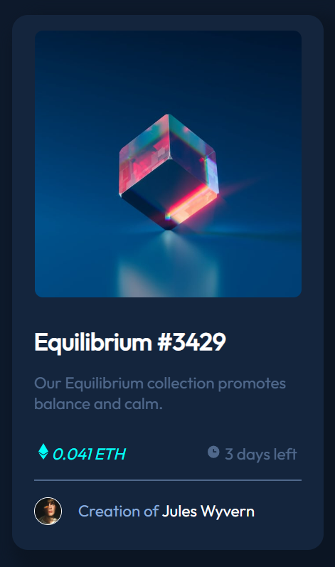

# Frontend Mentor - NFT preview card component solution

This is a solution to the [NFT preview card component challenge on Frontend Mentor](https://www.frontendmentor.io/challenges/nft-preview-card-component-SbdUL_w0U). Frontend Mentor challenges help you improve your coding skills by building realistic projects. 

## Table of contents

- [Overview](#overview)
  - [The challenge](#the-challenge)
  - [Screenshot](#screenshot)
- [My process](#my-process)
  - [Built with](#built-with)
  - [What I learned](#what-i-learned)
  - [Useful resources](#useful-resources)
- [Author](#author)

## Overview

  This one was kinda tricky since I've never used image hover effects... Still trying to figure out how to scale down the view icon and add thecyan color to the hover effect. Nonetheless, I really enjoyed this one! My first late night challenge xD

### The challenge

Users should be able to:

- View the optimal layout depending on their device's screen size
- See hover states for interactive elements

### Screenshot

## My process
  
  Really got stuck on the image hover effect... But with some time I got to a result that I liked.

### Built with

- Semantic HTML5 markup
- CSS custom properties
- Mobile-first workflow

### What I learned

  This challenge helped me to improvise and try new stuff on CSS!

**Note: Delete this note and the content within this section and replace with your own plans for continued development.**

### Useful resources

  Stack Overflow and Ninja Code all the way!
## Author

- Website - [Lucas Merino](WIP)
- Frontend Mentor - [@lucas-merino-dev](https://www.frontendmentor.io/profile/lucas-merino-dev)
- Github - [@lucas-merino-dev](https://www.github.com/lucas-merino-dev)